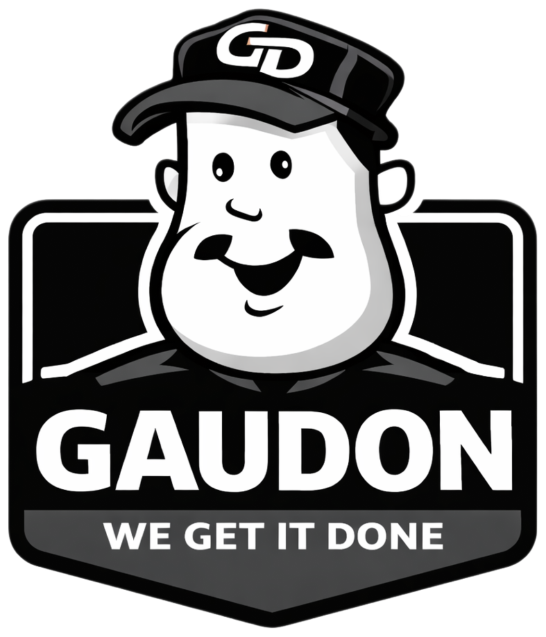

# GAUDON - Professional Silicone Sealants



Official website for **GAUDON USA LLC** - Premium silicone sealants for construction, kitchen & bath, windows & doors, and industrial applications.

**Live Site:** [https://www.gaudon.store](https://www.gaudon.store)

## About GAUDON

GAUDON is a professional manufacturer of high-performance silicone sealants with 25+ years of manufacturing experience. Our products are trusted by construction professionals in over 100 countries worldwide, backed by ISO 9001:2015 certification and a 30-year warranty.

### Product Lines
- **Kitchen & Bath Sealants** - Mold-resistant, waterproof formulas
- **Window & Door Sealants** - UV-stable, weatherproof sealing
- **Structural Sealants** - High-strength curtain wall bonding
- **Specialty Silicones** - Industrial and electronics applications

## Tech Stack

- **Frontend:** React 18 + Vite
- **Styling:** Tailwind CSS + shadcn/ui
- **Animations:** Framer Motion
- **Routing:** React Router DOM
- **Form Handling:** EmailJS

## Getting Started

### Prerequisites
- Node.js 18+
- npm or yarn

### Installation

```bash
# Clone the repository
git clone https://github.com/theaayushstha1/gaudon.global.git

# Navigate to project directory
cd gaudon.global

# Install dependencies
npm install

# Start development server
npm run dev
```

### Build for Production

```bash
npm run build
```

### Preview Production Build

```bash
npm run preview
```

## Project Structure

```
src/
├── components/
│   ├── home/          # Home page sections
│   ├── products/      # Product components
│   ├── shared/        # Global components
│   └── ui/            # shadcn/ui components
├── data/
│   ├── products.js    # Product catalog
│   └── company.js     # Company information
├── pages/             # Route pages
└── utils/             # Utility functions
```

## Pages

- **Home** - Landing page with product showcase
- **Products** - Full product catalog with filtering
- **Product Detail** - Individual product pages
- **About** - Company story and certifications
- **OEM** - Private label services
- **Calculator** - Coverage calculator
- **Contact** - Contact form

## Contact

**GAUDON USA LLC**
- Website: [gaudon.store](https://www.gaudon.store)
- Email: gaudonusallc@gmail.com
- Phone: +1 626-778-9568

---

*Professional Grade. 30 Year Warranty.*
